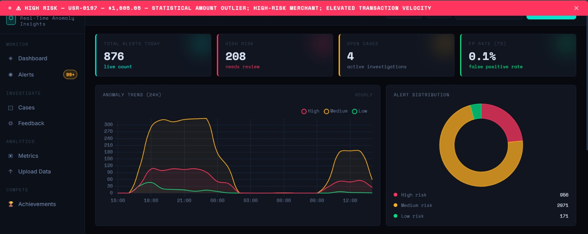

# Nexomaly 🔍

### AI-Powered Real-Time Financial Fraud Detection Platform

<div align="center">

**Detect financial fraud in milliseconds — not days**

</div>

---

## 🎯 Executive Summary

Nexomaly is a full-stack, real-time fraud detection and analyst operations platform built for financial institutions. It combines a weighted ML ensemble with live transaction streaming, SHAP-based explainability, case management, and a gamification layer that keeps analyst teams sharp and engaged.

The system integrates:

- Real-time transaction simulation and WebSocket streaming
- 4-model weighted ensemble (Isolation Forest + Random Forest + Statistical + Behavioral)
- 22-feature engineering pipeline with per-user behavioral profiling
- SHAP-style feature attribution and human-readable alert reasons
- Full analyst workflow: alerts → cases → feedback → model retraining
- Gamification engine with XP, 10 levels, 15 badges, and daily challenges

Alerts are generated in under 1 second using pre-trained models served via a FastAPI backend.

---

## 🖥️ Dashboard Preview



> Real-time anomaly monitoring — 876 alerts tracked, 208 high-risk flagged, 0.1% false positive rate, live 24h trend chart and alert distribution breakdown.

---

## 🚀 Quick Start

```bash
# 1. Install dependencies
pip install -r requirements.txt

# 2. Start the backend
cd backend
python main.py

or 

uvicorn main:app --host 0.0.0.0 --port 9000 --reload
```

**Dashboard opens at:** `http://localhost:9000/static/pages/dashboard.html`  
**API docs at:** `http://localhost:9000/docs`

---

## ✨ Key Features

<table>
<tr>
<td width="50%">

### 🤖 ML Ensemble Scoring
- **Isolation Forest** (35%) — unsupervised anomaly detection
- **Random Forest** (40%) — supervised fraud classifier
- **Statistical Model** (15%) — z-score outlier detection
- **Behavioral Heuristics** (10%) — velocity, time, location rules

</td>
<td width="50%">

### 🔬 Explainable AI
- SHAP-style per-alert feature contributions
- Human-readable top-3 risk reasons
- Feature importance breakdown per prediction
- Analyst feedback loop for continuous retraining

</td>
</tr>
<tr>
<td width="50%">

### 📊 Live Analytics Dashboard
- Real-time WebSocket alert stream
- 24h anomaly trend chart (High / Medium / Low)
- Alert distribution donut chart
- Model performance metrics (Precision, Recall, F1, AUC-ROC)

</td>
<td width="50%">

### 🏆 Analyst Gamification
- XP system with 10 analyst levels
- 15 unlockable achievement badges
- 3 rotating daily challenges
- Live leaderboard across analyst team

</td>
</tr>
</table>

---

## 💡 How It Works

```
Transaction In → Feature Extraction (22 features)
                        ↓
          ┌─────────────────────────┐
          │     Ensemble Scorer     │
          │  IF × 0.35              │
          │  RF × 0.40              │
          │  Statistical × 0.15     │
          │  Behavioral × 0.10      │
          └────────────┬────────────┘
                       ↓
              Risk Score (0–100)
                       ↓
          ┌────────────────────────┐
          │  Alert Engine          │
          │  SHAP Explainer        │
          │  WebSocket Broadcast   │
          └────────────────────────┘
                       ↓
          Analyst Reviews → Feedback → Retrain
```

### 1. Transaction Arrives
- Via real-time simulator (every 15s) or REST upload
- 200 simulated users, 25% anomaly injection rate

### 2. Feature Engineering
- 22 features extracted: amount stats, user velocity, merchant risk, time-of-day, location, interaction terms
- Per-user behavioral profile updated incrementally (Welford's online algorithm)

### 3. Ensemble Scoring
- All 4 models score in parallel
- Weighted ensemble produces final risk score 0–100
- Thresholds: **High ≥ 70**, **Medium ≥ 40**, **Low < 40**

### 4. Alert & Explainability
- Alert persisted to DB with SHAP contributions and top reasons
- Broadcast to all connected WebSocket clients instantly

### 5. Analyst Workflow
- Review alerts → link to cases → submit TP/FP feedback → trigger retraining

---

## 📊 ML Models

### Isolation Forest (35%)
Unsupervised anomaly detection trained on 5,000 synthetic transactions. Contamination rate: 12%. Scores 0–100 where higher = more anomalous.

### Random Forest (40%)
Supervised fraud classifier — 200 trees, `max_depth=12`, balanced class weights, `StandardScaler` normalization. Outputs fraud probability 0–100.

### Statistical Model (15%)
Z-score based outlier detection using global amount distribution (μ=250, σ=400) and per-user running statistics.

### Behavioral Heuristics (10%)
Rule-based scoring across: night transactions (+20), new merchants (+15), high-risk locations (+20), merchant risk score (+25), velocity spikes (+20), weekend high-amount combos (+10).

### Ensemble Formula
```
score = 0.35×IF + 0.40×RF + 0.15×stat + 0.10×behavioral
```

Weights are hot-reloadable from `models/saved/ensemble_weights.json`.

---

## 🗂️ Project Structure

```
Nexomaly-main/
├── backend/
│   ├── main.py                    # FastAPI app, lifespan, WebSocket, demo seeding
│   ├── config.py                  # Settings via pydantic-settings + .env
│   ├── alerts/alert_engine.py     # Transaction → alert processing
│   ├── cases/case_manager.py      # Case CRUD and alert linking
│   ├── db/
│   │   ├── database.py            # SQLAlchemy engine + session factory
│   │   ├── models.py              # Core ORM models (Transaction, Alert, Case, Feedback…)
│   │   └── gamification_models.py # AnalystProfile, Achievement, XPEvent, Leaderboard
│   ├── explainability/
│   │   └── shap_explainer.py      # Feature contributions + top reasons
│   ├── feedback/fp_manager.py     # False positive feedback handling
│   ├── gamification/engine.py     # XP, levels, badges, challenges, leaderboard
│   ├── models/
│   │   ├── ensemble.py            # Weighted ensemble scorer
│   │   ├── isolation_forest.py    # Unsupervised anomaly detection
│   │   ├── random_forest.py       # Supervised fraud classifier
│   │   ├── statistical.py         # Z-score statistical model
│   │   └── saved/                 # Persisted .pkl model files
│   ├── monitoring/metrics_tracker.py
│   ├── pipeline/
│   │   ├── cleaner.py             # Data cleaning + merchant risk scoring
│   │   ├── features.py            # 22-feature extraction + user profile updates
│   │   └── ingestion.py           # Synthetic dataset generation
│   ├── routers/                   # FastAPI route handlers (alerts, cases, feedback…)
│   ├── schema/models.py           # Pydantic request/response schemas
│   ├── scoring/risk_scorer.py     # Unified scoring entry point
│   ├── streaming/simulator.py     # Real-time transaction generator
│   ├── training/trainer.py        # Model training orchestration
│   └── tests/test_all.py
├── frontend/
│   ├── pages/
│   │   ├── dashboard.html         # Live alert feed + charts
│   │   ├── cases.html             # Case management
│   │   ├── investigation.html     # Single case deep-dive
│   │   ├── metrics.html           # Model performance
│   │   └── gamification.html      # XP, badges, leaderboard
│   ├── js/                        # api.js, dashboard.js, alerts.js, cases.js…
│   └── css/                       # main.css, gamification.css
├── data/
│   ├── raw/                       # Source CSVs
│   ├── processed/                 # Cleaned datasets
│   └── uploads/                   # User-uploaded datasets
├── docker/
│   ├── docker-compose.yml
│   ├── Dockerfile.backend
│   └── Dockerfile.frontend
├── ml_notebooks/                  # EDA, feature engineering, training, evaluation, SHAP
└── requirements.txt
```

---

## ⚙️ Getting Started

### Local (Python)

**Prerequisites:** Python 3.11+

```bash
cd Nexomaly-main

# Install dependencies
pip install -r requirements.txt

# Start the server
cd backend
python main.py
or 
uvicorn main:app --host 0.0.0.0 --port 9000 --reload
```


### Docker

**Prerequisites:** Docker + Docker Compose

```bash
cd Nexomaly-main/docker
docker-compose up --build
```


```bash
# Stop all services
docker-compose down
```

Named volumes (`pgdata`, `models`, `uploads`) persist data across restarts.

---

## 🔧 Configuration

All settings live in `backend/config.py` and can be overridden via environment variables or a `.env` file.

| Variable | Default | Description |
|---|---|---|
| `DATABASE_URL` | `sqlite:///./anomalyos.db` | Database connection string |
| `ML_MODELS_PATH` | `backend/models/saved` | Saved `.pkl` model directory |
| `RISK_THRESHOLD_HIGH` | `70.0` | Minimum score for a high alert |
| `RISK_THRESHOLD_MEDIUM` | `40.0` | Minimum score for a medium alert |
| `SIMULATION_INTERVAL` | `15.0` | Seconds between simulated transactions |
| `SIMULATION_ENABLED` | `true` | Toggle background simulator |
| `UPLOADS_PATH` | `backend/uploads` | CSV upload directory |

---

## 📡 API Reference

| Router | Prefix | Description |
|---|---|---|
| Alerts | `/api/alerts` | List, filter, update alert status |
| Cases | `/api/cases` | CRUD for investigation cases, link alerts |
| Feedback | `/api/feedback` | Submit TP/FP labels, trigger retraining |
| Metrics | `/api/metrics` | Model performance metrics history |
| Data | `/api/data` | Upload CSV datasets, manage training data |
| Gamification | `/api/gamification` | Analyst profiles, XP, badges, leaderboard |
| Health | `/api/health` | Liveness check |
| WebSocket | `/ws/alerts` | Real-time alert stream |

---

## 🏆 Gamification System

Analysts earn XP through actions and progress through 10 levels:

| Level | Title | XP Required |
|---|---|---|
| 1 | Rookie Analyst | 0 |
| 2 | Junior Investigator | 500 |
| 3 | Fraud Analyst | 1,500 |
| 4 | Senior Analyst | 3,000 |
| 5 | Lead Investigator | 6,000 |
| 6 | Fraud Specialist | 10,000 |
| 7 | Principal Analyst | 15,000 |
| 8 | Fraud Architect | 25,000 |
| 9 | Elite Detector | 40,000 |
| 10 | Guardian of Finance | 60,000 |

**XP Events:**

| Action | XP Delta |
|---|---|
| Confirmed fraud detection | +100 |
| New pattern identified | +200 |
| Innovation / model improvement | +25 |
| Case completed | +50 |
| Speed bonus (< 60s) | +75 |
| False positive submitted | −50 |

**15 Unlockable Badges** — First Blood 🩸, Eagle Eye 🦅, Speed Demon ⚡, Guardian 🛡️, Centurion 💯, Detective 🕵️, Precision 🎯, Night Owl 🦉, Marathon 🏃, Top Gun 🏆, and more.

**3 Daily Challenges** rotate every 24 hours — Rush Hour, Pattern Hunt, Speed Trial, Threshold Tuning, Model Marathon, and others.

---

## 📊 Dashboard Guide

### Score Interpretation

| Score Range | Risk Level | Action |
|---|---|---|
| 70–100 | 🔴 High | Immediate review required |
| 40–70 | 🟡 Medium | Review within the hour |
| 0–40 | 🟢 Low | Monitor / auto-resolve |

### Alert Statuses

| Status | Meaning |
|---|---|
| `new` | Just generated, unreviewed |
| `resolved` | Confirmed true positive |
| `false_positive` | Analyst marked as FP |
| `investigating` | Linked to an open case |

---

## 🔬 Feature Engineering

22 features are extracted per transaction:

| Category | Features |
|---|---|
| Amount | `amount`, `log_amount`, `amount_zscore`, `amount_vs_user_avg`, `amount_vs_user_std`, `is_high_amount`, `is_very_high_amount` |
| Velocity | `user_tx_count`, `user_tx_last_hour`, `user_tx_last_day`, `velocity_ratio` |
| Time | `hour`, `day_of_week`, `is_weekend`, `is_night`, `is_business_hours` |
| Merchant / Location | `merchant_risk_score`, `is_high_risk_location`, `is_high_risk_category`, `is_new_merchant` |
| Interactions | `amount_x_merchant_risk`, `amount_x_night` |

---

## 🎯 System Metrics

| Metric | Value |
|---|---|
| Simulated users | 200 |
| Anomaly injection rate | 25% |
| Features per transaction | 22 |
| Ensemble models | 4 |
| Alert risk levels | 3 (High / Medium / Low) |
| Analyst levels | 10 |
| Achievement badges | 15 |
| Daily challenges | 3 (rotating) |
| Prediction latency | < 1 second |
| API framework | FastAPI 0.110 |
| Default simulation interval | 15 seconds |

---

## 🛠️ Tech Stack

| Layer | Technology |
|---|---|
| Backend | Python 3.11, FastAPI 0.110, Uvicorn |
| ORM | SQLAlchemy 2.0, Alembic |
| ML | scikit-learn 1.4, numpy 1.26, pandas 2.2, joblib |
| Explainability | SHAP 0.44 |
| Database | SQLite (dev) · PostgreSQL 15 (prod) |
| Frontend | Vanilla HTML / CSS / JavaScript |
| Realtime | WebSockets (websockets 12.0) |
| Auth utilities | python-jose, passlib/bcrypt |
| Containerization | Docker, docker-compose 3.8 |
| Testing | pytest 8.1, pytest-asyncio |

---

## 🗺️ Roadmap

### ✅ Phase 1: Core ML System — Foundation
- [x] Data collection (synthetic transactions / logs)
- [x] Data cleaning — nulls, scaling, normalization
- [x] Feature engineering — transaction frequency, amount deviation, new merchant flag
- [x] Isolation Forest (primary anomaly detection model)
- [x] Statistical baseline — Z-score, IQR
- [x] Behavioral model — user pattern deviation
- [x] Model persistence via `joblib.dump`

### ✅ Phase 2: Backend (FastAPI)
- [x] `/predict` — anomaly score endpoint
- [x] `/train` — model retraining endpoint
- [x] `/health` — liveness check
- [x] Input validation with Pydantic schemas
- [x] Error handling and structured logging
- [x] Modular structure — `routes/`, `services/`, `ml_models/`

### ✅ Phase 3: Real-Time Detection Logic
- [x] Anomaly score 0–100 per transaction
- [x] Risk level classification — Low / Medium / High
- [x] Human-readable reason generation ("High transaction velocity", "New merchant detected")
- [x] Combined scoring — ML score + rule-based score → final ensemble score

### ✅ Phase 4: Frontend Dashboard
- [x] Dashboard — anomaly stats and live feed
- [x] Alerts page — flagged transactions with risk levels
- [x] Transaction viewer / investigation page
- [x] Anomaly trend chart (24h, High / Medium / Low)
- [x] Risk distribution donut chart
- [x] Cases and Feedback pages

### ✅ Phase 5: Database Integration
- [x] PostgreSQL (prod) / SQLite (dev) support
- [x] Tables — transactions, alerts, cases, feedback, model metrics, user profiles
- [x] Transaction insert and alert persistence
- [x] History tracking and analyst feedback storage

### ✅ Phase 6: Advanced ML
- [x] Ensemble model — Isolation Forest + Random Forest + Statistical + Behavioral
- [x] SHAP-style explainability with feature contribution breakdown
- [x] Feature importance per prediction
- [x] Anomaly Score Breakdown view per alert

### ✅ Phase 7: System Design Upgrade
- [x] Async processing via FastAPI lifespan + asyncio
- [x] Modular service architecture — pipeline, scoring, alerts, cases, feedback
- [x] Full pipeline — Input → Preprocessing → Model → Scoring → API → Dashboard
- [x] WebSocket real-time broadcast to connected clients

### ✅ Phase 8: Dockerization
- [x] Backend container
- [x] Frontend container (nginx)
- [x] PostgreSQL container
- [x] Docker Compose with named volumes and health checks

### 📅 Phase 9: Cloud Deployment
- [ ] Deploy backend to Railway / Render / AWS EC2
- [ ] Deploy frontend to Vercel / Netlify / S3 + CloudFront
- [ ] Managed PostgreSQL (Railway Postgres / AWS RDS / Supabase)
- [ ] Environment-based config (`.env.production`)
- [ ] CI/CD pipeline (GitHub Actions — test → build → deploy)
- [ ] Domain + HTTPS (SSL via Let's Encrypt / provider cert)
- [ ] Production logging and uptime monitoring

---

## ⚠️ Limitations

- Transaction simulator uses synthetic data — not calibrated to real-world fraud distributions
- SHAP contributions are approximated via importance weights, not true Shapley values
- No real-time model drift detection in the current version
- Authentication and multi-user isolation are not yet implemented
- Behavioral profiles reset on DB wipe (no persistence across retraining cycles)

---

## 🔧 Troubleshooting

### Backend won't start
```bash
pip install -r requirements.txt
cd backend
python main.py
or 
uvicorn main:app --host 0.0.0.0 --port 9000 --reload
```

### Models not loading
- Check `backend/models/saved/` contains `.pkl` files
- Delete stale `.pkl` files to force retraining on next startup

### Docker: database connection refused
```bash
# Wait for postgres healthcheck to pass, then retry
docker-compose up --build
```

### WebSocket not receiving alerts
- Confirm `SIMULATION_ENABLED=true` in config or `.env`
- Check browser console for WebSocket connection errors at `ws://localhost:9000/ws/alerts`
